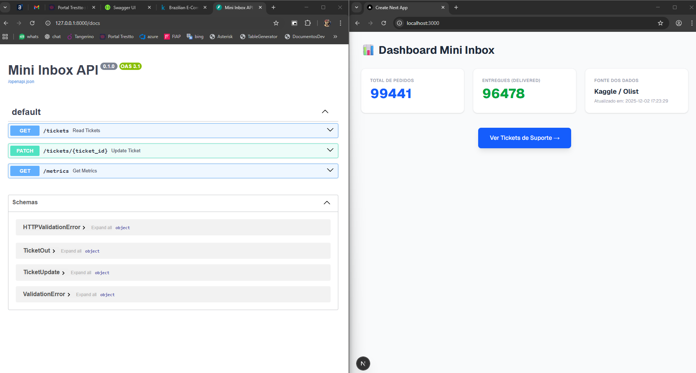
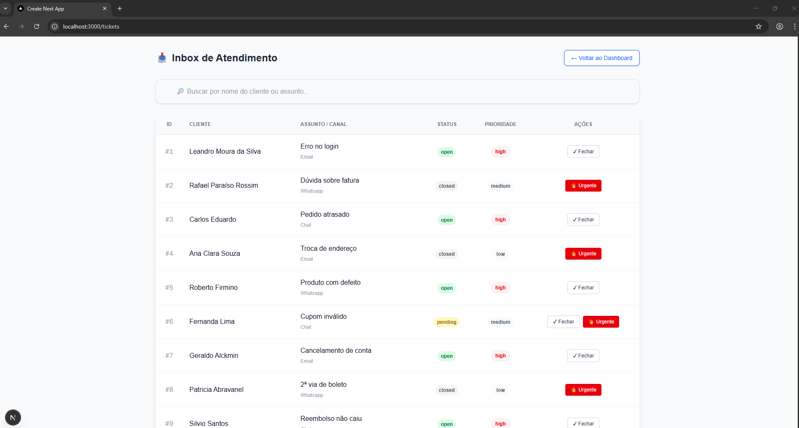

# Desafio Técnico Stalse

Solução Full Stack para gerenciamento de tickets de suporte, integrando processamento de dados (ETL), API REST e automação via Webhook.

Embora o Frontend fosse opcional, este projeto inclui uma interface completa desenvolvida em **Next.js (App Router)** para melhor visualização das funcionalidades.

## Arquitetura & Tecnologias - Stacks

* **Backend:** Python 3.11 + FastAPI + SQLite (SQLAlchemy)
* **Frontend:** Next.js 14 + TailwindCSS (App Router)
* **Dados (ETL):** Pandas (Processamento do dataset Olist)
* **Automação:** Webhook trigger (Simulação de integração com n8n)

## Pré-requisitos

* Python 3.x
* Node.js 18+
* Dataset do Kaggle (Instruções abaixo)

---

## Como Rodar o Projeto

Siga a ordem abaixo para garantir o funcionamento correto (o Backend depende dos dados gerados pelo ETL).

### 1. Preparação dos Dados (ETL)
O sistema utiliza dados reais do E-commerce brasileiro.

1.  Baixe o arquivo `olist_orders_dataset.csv` do Kaggle:
    * **Link:** [Brazilian E-Commerce Public Dataset by Olist](https://www.kaggle.com/datasets/olistbr/brazilian-ecommerce)
2.  Coloque o arquivo baixado na pasta: `data/raw/olist_orders_dataset.csv`. (necessário criar diretório raw, pois o gitignore restringi o arquivo, visando segurança e boas práticas em proteção de dados).
3.  Execute o script de processamento:
    ```bash
    pip install pandas
    python data/etl.py
    ```
    *Saída esperada: " SUCESSO! ETL Finalizado."*

### 2. Backend (API)
Em um terminal, inicie a API:

```bash
cd backend
pip install -r requirements.txt
python -m uvicorn main:app --reload
```


A API estará rodando em: http://127.0.0.1:8000

Documentação Interativa (Swagger): http://127.0.0.1:8000/docs

Nota: O banco de dados db.sqlite será criado automaticamente e populado com tickets iniciais (Seeds).


### 3. Frontend (Interface)

Em outro terminal, acesse a pasta do frontend e inicie o servidor:

```Bash

cd frontend
npm install
npm run dev
```

Acesse a aplicação em: http://localhost:3000


Automação & Webhook (n8n)

Conforme solicitado no desafio, o sistema dispara um Webhook automaticamente quando uma regra de negócio específica é atendida.

Regra de Disparo: Ocorre quando um ticket é alterado para status=closed OU priority=high.

Integração: O backend envia um POST para um endpoint externo. Para este MVP, foi utilizada uma URL do webhook.site para validar o disparo sem necessidade de infraestrutura local complexa.


Exemplo de Payload Enviado
Este é o formato JSON que o n8n recebe quando o gatilho é acionado:

```Bash
{
  "event": "ticket_updated",
  "ticket_id": 1,
  "new_status": "closed",
  "new_priority": "high",
  "customer": "Leandro Moura da Silva",
  "updated_at": "2025-12-02 14:30:00.123456"
}
```


Arquivos de Entrega
Na pasta /n8n deste repositório encontram-se:

workflow.json: Arquivo de exportação do fluxo para importação no n8n.

capturas de tela png: Evidência do funcionamento (Backend disparando para o Webhook).


Screenshots
Dashboard (Consumo do ETL)

Visualização dos dados processados do Kaggle via Pandas.

Inbox de Tickets e FastAPI (Gerenciamento)


Interface para listagem e atualização de tickets (integração com API).



##  Debug & Desenvolvimento (VS Code)

Visando Facilidade na correção/debugg do projeto, disponibilizo o VS Code e as configs lauch.json para depuração em mode F5.

1. Acesse a aba **"Run and Debug"** (Ctrl+Shift+D).
2. Selecione a opção **"🚀 Fullstack: Front + Back"**.
3. Pressione **F5**.

Isso iniciará automaticamente:
* O servidor Backend (FastAPI) com debugger conectado.
* O navegador Chrome conectado ao Frontend (Next.js). (obs: ainda sim necessário rodar npm run dev no diretório desafio-stalse/frontend)


Desenvolvido por: Leandro Moura

